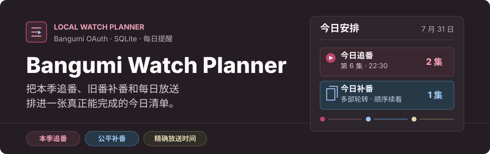

<p align="center">
  
</p>

# Bangumi Watch Planner

这是一个运行在自己电脑上的 Bangumi 追番计划工具。它会同步“在看”和“想看”收藏，按实际放送时间整理本季新番，再把旧番补番安排进当天还有余量的时段。数据保存在本地 SQLite，收藏和分集进度仍以 Bangumi 为准。


## 主要功能

- **今日**：本季待看和旧番补番分区显示，可标记看过、推迟到明天或换一部。
- **追番**：只显示活动季度内仍在更新的动画，可展开完整分集并修正进度。
- **补番计划**：旧番按公平轮转排期；同一天有多个名额时，优先安排不同番剧。
- **想看**：读取 Bangumi“想看”列表，支持名称和年份筛选；未播出的动画不会进入追番或补番。
- **每日放送**：显示日期、小时和数据来源，可保存整部动画的本地时间偏移。
- **后台同步**：每天 `20:00 Asia/Shanghai` 同步一次，并按天去重发送一条汇总提醒。

## 下载和启动

### Windows 10 / 11

1. 打开仓库的 [Releases](https://github.com/Tr1meputiNe/bangumi-watch-planner/releases)，进入最新版本，下载名称以 `-windows-x64.zip` 结尾的文件。
2. 解压到一个固定目录，不要只在压缩包预览中运行。
3. 双击 `Start Bangumi Watch Planner.cmd`。脚本会启动本地服务并打开 `http://127.0.0.1:3777/`。
4. 需要开机后继续提醒时，再双击 `Install Startup.cmd`；`Uninstall Startup.cmd` 可以移除启动项。

便携包中的 `Bangumi-Watch-Planner.exe` 是服务本体，旁边的 `node_modules` 和 `dist` 目录必须保留。当前版本没有商业代码签名，Windows SmartScreen 可能在首次运行时提示确认；Release 同时提供 `SHA256SUMS.txt` 用于核对下载文件。

### macOS

安装 [Node.js 22 或更高版本](https://nodejs.org/) 后，在项目目录运行：

```bash
npm ci
```

Finder 中双击 `Start Bangumi Watch Planner.command`，它会完成构建、安装 LaunchAgent 并打开页面。也可以手动运行：

```bash
npm run build
npm start
```

### 自行部署

克隆本仓库后运行：

```bash
npm ci
npm run build
npm start
```

生产服务默认监听 `0.0.0.0:3777`。只允许本机访问时，在 `.env.local` 中设置 `HOST=127.0.0.1`。

## 配置 Bangumi OAuth

1. 在 [Bangumi 开发者平台](https://bgm.tv/dev)创建应用。
2. 本机使用时，把回调地址填写为：

   ```text
   http://127.0.0.1:3777/auth/callback
   ```

3. 启动应用，在登录页填写 Bangumi App ID 和 App Secret。
4. 点击“使用 Bangumi 登录”并完成授权。首次同步会在回到首页后继续执行，不会卡住登录跳转。

也可以复制环境文件：

```bash
cp .env.example .env.local
```

```text
BANGUMI_CLIENT_ID=你的 App ID
BANGUMI_CLIENT_SECRET=你的 App Secret
APP_BASE_URL=http://127.0.0.1:3777
```

如果服务部署在另一台主机，`APP_BASE_URL` 和 Bangumi 开发者平台中的回调地址必须完全一致，并且浏览器能够访问该地址。

## 排期规则

当天的补番容量取决于当天新播出的追番集数：

| 当天新番 | 补番容量 |
| --- | --- |
| 0 至 1 集 | 2 集 |
| 2 至 4 集 | 1 集 |
| 超过 4 集 | 0 集 |

多部旧番按 `A1, B1, C1, A2` 的方式轮转。计划只安排 `episode.type === 0` 的本篇，并且不会跳过前面未看的集数。自动同步会保留今天已锁定的任务，只重排之后七天；点击“重新规划今天”才会解锁并重排当天。

总集数可信且本篇全部看完时，旧番会自动改为 Bangumi“看过”。总集数未知时不会擅自完成，可在页面中手动处理。

## 季度和放送时间

季度数据优先采用 [ACG Secrets](https://acgsecrets.hk/bangumi/)。每季度以最早的正常首播日为第一天，之后 14 个自然日允许新旧季度共存；跨季续播动画会继续留在追番。

日本 `25:00` 等 30 小时制时间会先换算成上海时区的实际日期和小时，再参与星期与每日负载计算。每日放送缺少 ACG Secrets 数据时，会依次回退到 Bangumi Index、Bangumi Data 和 Bangumi 日历。页面中的“校正时间”可保存日期差和播出小时，“恢复来源”会删除本地修正。

## 后台提醒

| 平台 | refresh token | 系统提醒 | 后台启动 |
| --- | --- | --- | --- |
| macOS | Keychain | `osascript` 通知 | LaunchAgent |
| Windows | 当前用户 DPAPI | Windows Toast | 启动文件夹快捷方式 |
| Linux | 权限为 `0600` 的本地文件 | 写入服务日志 | 由 systemd 等服务管理器负责 |

提醒默认每天 `20:00 Asia/Shanghai` 执行，先同步，再汇总当天新番和补番任务；同一天只发送一次。可在 `.env.local` 修改：

```text
REMINDER_CRON=0 20 * * *
NOTIFICATIONS_ENABLED=true
```

## 局域网访问

同一网络中的设备可以打开运行主机的 `3777` 端口。例如 Mac 的地址是 `192.168.1.23`，手机可访问：

```text
http://192.168.1.23:3777/
```

OAuth 重新授权仍应在运行服务的电脑上完成。局域网内任何能访问该端口的设备都能查看页面，请不要把端口直接暴露到公网。

## 收藏状态

| Bangumi 状态 | 本地用途 |
| --- | --- |
| `1` 想看 | 保留在想看，不自动改为在看 |
| `3` 在看 + 活动季度 | 本季追番 |
| `3` 在看 + 非活动季度 | 补番进行中 |
| `4` 搁置 | 补番搁置 |
| `2` 看过 | 已完成 |

搜索、加入想看和加入补番会先更新页面，再由后台串行写回 Bangumi。失败时会恢复原状态并显示可重试错误。

## 隐私

- Bangumi App Secret 只保存在本机环境文件或 SQLite 设置中。
- access token、refresh token 和本地写入令牌不会发送到前端或提交到 Git。
- 应用使用 OAuth，不保存 Bangumi 账号密码。
- `.env.local`、`data/` 和 `logs/` 已加入 `.gitignore`。

## 开发

```bash
npm ci
npm run dev
```

前端开发服务器位于 `http://127.0.0.1:5173`，API 代理到 `3777`。

提交前运行：

```bash
npm test
npm run lint
npm run build
git diff --check
```

Windows 便携包由 `.github/workflows/release.yml` 在推送 `v*` 标签后自动构建并发布。
